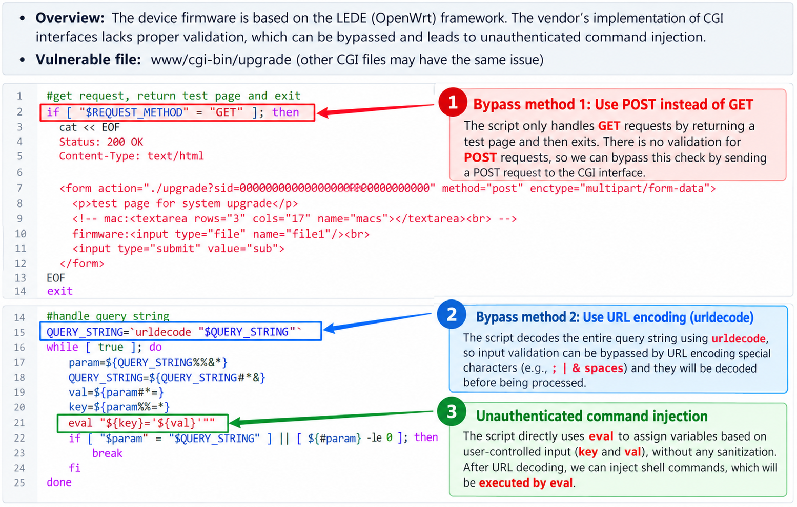
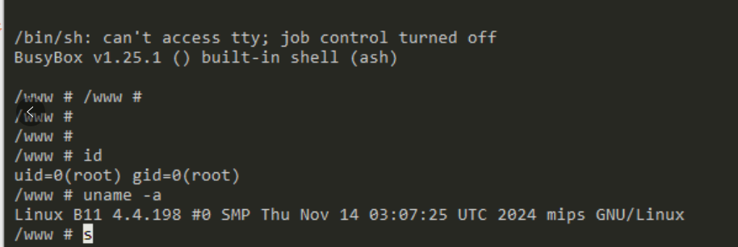
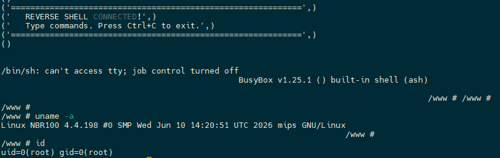

# Netcore router unauthenticated remote code execution (CVE-2026-78796)

## Summary

A vulnerability in the Netcore B11 and other router (v1.3.241114.024540 and earlier) and multiple other device models allows a remote attacker to execute arbitrary code.

## Affected Product
- Vendor: Netcore
- Product: Netcore B6/B11/NBR100 etc
- Affected Versions: v1.3.241114.024540 and earlier

## Vulnerability Detail
- Overview: The device firmware is based on the LEDE (OpenWrt) framework. The vendor failed to implement proper input validation in the CGI interfaces, allowing validation checks to be bypassed and resulting in unauthenticated command injection.
- Vulnerable File: www/cgi-bin/upgrade (other CGI files may also be affected by the same vulnerability).

## POC
[exploit.py](exploit.py)

## Timeline
- 2026/5/7 - Vulnerability discovered during security testing of the Netcore B11 router.
- 2026/6/12 - Requests to MITRE for CVE.
- 2026/9/14 - Publicly disclosed after repeated attempts to contact the vendor received no response.
